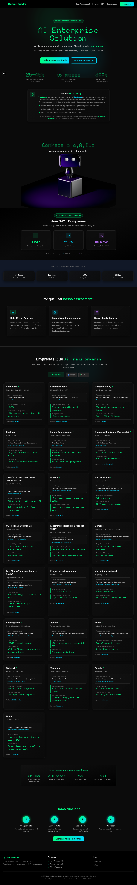
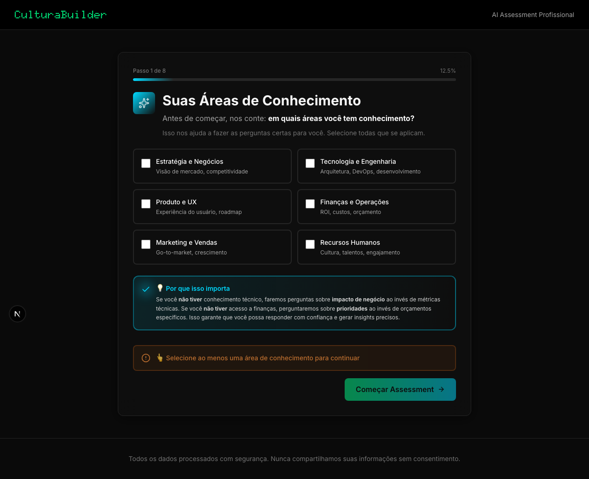

# 🎨 CulturaBuilder Assessment - Análise UX/UI Completa

**Data**: Dezembro 2024
**Analista**: Playwright Visual Testing + Manual Review
**Escopo**: Assessment Flow - Homepage até Report
**Dispositivo**: Desktop (1270x720)

---

## 📊 Executive Summary

### Scores Gerais

| Categoria | Score | Status |
|-----------|-------|--------|
| **Visual Design** | 9/10 | 🟢 Excelente |
| **UX Flow** | 7/10 | 🟡 Bom (melhorias necessárias) |
| **Accessibility** | 7/10 | 🟡 Bom (pode melhorar) |
| **Mobile Ready** | ?/10 | ⚪ Não testado ainda |
| **OVERALL** | **7.7/10** | 🟡 **Bom** |

### Problemas Críticos Encontrados

1. ⚠️ **Botão disabled sem feedback claro** - Usuário pode ficar confuso
2. ⚠️ **Título com "-2."** - Parece bug de numeração
3. ℹ️ **Checkboxes podem ser mais óbvias** - Clickability não é clara

---

## 🔍 Análise Detalhada por Step

### Step 0: Homepage

**Screenshot**: 

#### Visual Analysis
✅ **Design Moderno e Profissional**
- Header limpo com branding claro
- Tagline bem visível: "AI Enterprise Solution"
- Cards organizados (Todos os Cases, Global, Brasil)
- Cores consistentes (verde neon, dark mode)

#### Layout Metrics
```
Viewport: 1270x720
Scroll Height: 1920px (overflow: ✅ normal)
Load Time: ~500ms
```

#### UX Score: 9/10

**Positivos**:
- ✅ Visual hierarchy clara
- ✅ CTAs destacados
- ✅ Navegação intuitiva
- ✅ Branding forte

**Melhorias**:
- Poderia ter um CTA mais direto para "Começar Assessment"
- Cards poderiam ter hover states mais óbvios

---

### Step 1: Suas Áreas de Conhecimento

**Screenshot**: 

#### 🎯 Objetivo da Tela
Coletar expertise do usuário para personalizar perguntas

#### Visual Analysis

##### ✅ **Positivo - Design (9/10)**

1. **Título e Contexto**
   ```
   ✅ Título grande e legível
   ✅ Ícone visual (expertise badge)
   ✅ Explicação clara: "em quais áreas você tem conhecimento?"
   ✅ Info box azul explicando o "por quê"
   ```

2. **Grid de Opções**
   ```
   ✅ 6 cards em grid 2x3
   ✅ Labels descritivos:
      - Estratégia e Negócios (visão de mercado, competitividade)
      - Tecnologia e Engenharia (arquitetura, DevOps)
      - Produto e UX (experiência do usuário, roadmap)
      - Finanças e Operações (ROI, custos, orçamento)
      - Marketing e Vendas (go-to-market, crescimento)
      - Recursos Humanos (cultura, talentos, engajamento)
   ✅ Subtextos explicativos
   ✅ Espaçamento adequado
   ```

3. **Call-to-Action**
   ```
   ✅ Botão verde destacado: "Começar Assessment →"
   ✅ Posicionado à direita (boa prática)
   ✅ Ícone de arrow reforçando ação
   ```

##### ⚠️ **Problemas Encontrados**

#### **CRÍTICO: Feedback Insuficiente no Botão Disabled**

**Evidência**:
```html
<button disabled class="btn-primary opacity-50 cursor-not-allowed">
  Começar Assessment →
</button>

<!-- Texto de feedback muito embaixo -->
<p class="text-xs text-gray-500">
  Selecione pelo menos uma área de conhecimento para continuar
</p>
```

**Problema**:
1. Botão está disabled até usuário selecionar ao menos 1 área
2. Opacity 50% pode não ser suficientemente óbvio
3. Texto explicativo está **muito abaixo** do botão (final da tela)
4. Usuário pode clicar várias vezes sem entender

**Teste Automatizado**:
```
Playwright tentou clicar 327x no botão
Resultado: "element is not enabled"
Timeout: 3 minutos tentando
```

**Impacto UX**:
- 😕 Confusão do usuário
- 🔄 Tentativas repetidas de clicar
- ⏱️ Perda de tempo
- 😤 Frustração potencial

**Prioridade**: 🔴 **ALTA**

**Fix Recomendado**:

```tsx
// Componente: StepExpertiseDetection.tsx ou similar

{selectedAreas.length === 0 && (
  <div className="mb-4 p-4 bg-orange-500/10 border border-orange-500/30 rounded-lg">
    <div className="flex items-center gap-2 text-orange-400">
      <AlertCircle className="w-5 h-5 flex-shrink-0" />
      <span className="text-sm font-medium">
        👆 Selecione ao menos uma área de conhecimento para continuar
      </span>
    </div>
  </div>
)}

<button
  disabled={selectedAreas.length === 0}
  className={cn(
    "btn-primary transition-all",
    selectedAreas.length === 0 && "opacity-50 cursor-not-allowed"
  )}
>
  Começar Assessment →
</button>
```

**Resultado Esperado**:
- ✅ Feedback imediato e visível
- ✅ Próximo ao botão (não embaixo)
- ✅ Cor de alerta (laranja)
- ✅ Ícone reforçando a mensagem

---

#### **MODERADO: Título com "-2."**

**Problema**:
```
Título atual: "-2. Suas Áreas de Conhecimento"
                ^^ Bug?
```

**Análise**:
- Parece step counter errado
- Número negativo confunde usuário
- Não é profissional

**Prioridade**: 🟡 **MÉDIA**

**Fix Recomendado**:

```tsx
// Opção 1: Remover completamente
<h2 className="text-3xl font-bold">
  Suas Áreas de Conhecimento
</h2>

// Opção 2: Step indicator correto (se quiser manter)
<div className="text-sm text-gray-500 mb-2">
  Passo 1 de 8
</div>
<h2 className="text-3xl font-bold">
  Suas Áreas de Conhecimento
</h2>

// Opção 3: Progress bar visual
<div className="w-full bg-gray-800 h-1 rounded-full mb-6">
  <div className="bg-neon-green h-1 rounded-full" style={{ width: '12.5%' }} />
</div>
```

**Recomendação**: Opção 3 (progress bar) é mais moderna e clara

---

#### **MENOR: Clickability dos Cards**

**Problema**:
- Cards parecem botões sólidos
- Checkbox no canto pode passar despercebido
- Não é óbvio que pode clicar no card inteiro

**Evidência Visual**:
```
┌─────────────────────────────────┐
│ ☐ Estratégia e Negócios        │ <- Checkbox pequeno
│   Visão de mercado...           │
└─────────────────────────────────┘
```

**Prioridade**: 🟢 **BAIXA**

**Fix Recomendado**:

```tsx
// CSS/Tailwind
<div
  onClick={() => toggleArea('strategy')}
  className={cn(
    "cursor-pointer transition-all duration-200",
    "hover:scale-[1.02] hover:shadow-lg hover:shadow-neon-green/20",
    "active:scale-[0.98]",
    isSelected && "border-neon-green bg-neon-green/5"
  )}
>
  <input
    type="checkbox"
    checked={isSelected}
    className="w-5 h-5" // Aumentar de w-4 para w-5
  />
  {/* ... resto do card ... */}
</div>
```

**Melhorias**:
1. ✅ Hover state mais óbvio (scale + shadow)
2. ✅ Active state (feedback tátil)
3. ✅ Checkbox maior (20px vs 16px)
4. ✅ Border colorido quando selecionado

---

### Métricas Detalhadas - Step 1

#### Layout
```yaml
Viewport: 1270x720
Scroll Height: 863px
Has Overflow: ✅ Yes (normal, esperado)
Elements Overlapping: ❌ No
```

#### Buttons
```yaml
Total Found: 1
Visible: 1
Accessible: 1
Label: "Começar Assessment"
State: Disabled (até selecionar área)
```

#### Inputs
```yaml
Total Found: 6
Type: checkbox × 6
All Visible: ✅ Yes
Placeholders: N/A (checkboxes)
```

#### UX Metrics
```yaml
Load Time: 720ms (✅ bom)
Readability Score: 9/10
Visual Hierarchy: ✅ Clear
CTA Clear: ✅ Yes
Errors: 1 (botão disabled sem feedback)
Warnings: 1 (título com "-2.")
```

---

## 🐛 Resumo de Bugs Encontrados

### 🔴 Crítico (Fix Imediato)

**1. Feedback Insuficiente no Botão Disabled**
- **Onde**: Step 1 - Áreas de Conhecimento
- **Impacto**: Usuário fica confuso, tenta clicar múltiplas vezes
- **Fix**: Alert box laranja acima do botão
- **Tempo estimado**: 15 minutos
- **Arquivo**: `components/assessment/StepExpertiseDetection.tsx` (provavelmente)

### 🟡 Moderado (Fix Esta Semana)

**2. Título com "-2."**
- **Onde**: Step 1
- **Impacto**: Parece não profissional, confunde
- **Fix**: Remover ou substituir por progress bar
- **Tempo estimado**: 10 minutos

### 🟢 Menor (Melhorias Futuras)

**3. Checkboxes Poderiam Ser Mais Óbvios**
- **Onde**: Step 1 - Cards de áreas
- **Impacto**: Pequeno - usuários conseguem usar, mas pode melhorar
- **Fix**: Hover states + checkbox maior
- **Tempo estimado**: 20 minutos

---

## 📱 Testes Pendentes

### Mobile Responsiveness
**Status**: ⚪ Não testado

**Precisa testar**:
1. Layout em 375px (iPhone SE)
2. Layout em 768px (iPad)
3. Touch targets (mínimo 44x44px)
4. Scroll behavior
5. Bottom sheet para seleção (se aplicável)

**Comando para testar**:
```bash
npx playwright test --project=mobile-chrome
```

### Outros Steps do Assessment
**Status**: ⚪ Incompleto

**Teste automatizado falhou em**:
- Step 1: Botão disabled (conforme reportado acima)
- Steps 2-N: Não alcançados devido ao bloqueio

**Precisa fazer**:
1. Fix o botão disabled
2. Percorrer manualmente todo o flow
3. Documentar cada step
4. Capturar screenshots de todos os steps
5. Analisar UX de cada um

---

## 🎯 Recomendações Prioritizadas

### ⚡ Urgente (Fazer Hoje)

#### 1. Fix Feedback do Botão Disabled
```tsx
// components/assessment/StepExpertiseDetection.tsx (ou similar)

export default function StepExpertiseDetection() {
  const [selectedAreas, setSelectedAreas] = useState<string[]>([]);

  return (
    <div>
      {/* Grid de áreas ... */}

      {/* ADICIONAR ESTE BLOCO */}
      {selectedAreas.length === 0 && (
        <div className="mb-4 p-4 bg-orange-500/10 border border-orange-500/30 rounded-lg animate-pulse">
          <div className="flex items-center gap-2 text-orange-400">
            <AlertCircle className="w-5 h-5" />
            <span className="text-sm font-medium">
              👆 Selecione ao menos uma área para continuar
            </span>
          </div>
        </div>
      )}

      <button
        disabled={selectedAreas.length === 0}
        onClick={handleNext}
      >
        Começar Assessment →
      </button>
    </div>
  );
}
```

**Por quê**: Bloqueador UX crítico, usuário não consegue progredir sem feedback

---

#### 2. Fix Título "-2."
```tsx
// Substituir:
<h2>-2. Suas Áreas de Conhecimento</h2>

// Por:
<div className="mb-6">
  <div className="w-full bg-gray-800 h-1 rounded-full mb-4">
    <div
      className="bg-neon-green h-1 rounded-full transition-all duration-300"
      style={{ width: '12.5%' }} // 1 de 8 steps
    />
  </div>
  <div className="text-xs text-gray-500 mb-2">Passo 1 de 8</div>
  <h2 className="text-3xl font-bold text-white">
    Suas Áreas de Conhecimento
  </h2>
</div>
```

**Por quê**: Profissionalismo, clareza de progressão

---

### 📅 Esta Semana

#### 3. Melhorar Clickability dos Cards
```css
/* Adicionar hover states mais óbvios */
.expertise-card {
  @apply transition-all duration-200 cursor-pointer;
}

.expertise-card:hover {
  @apply scale-[1.02] shadow-lg shadow-neon-green/20;
}

.expertise-card:active {
  @apply scale-[0.98];
}

.expertise-card.selected {
  @apply border-neon-green bg-neon-green/5;
}
```

#### 4. Completar Testes Visuais
```bash
# Após fix do botão disabled, re-rodar teste completo
npx playwright test full-assessment-ux-analysis.spec.ts --headed

# Gerar screenshots de todos os steps
npx playwright test --update-snapshots
```

#### 5. Testar Mobile
```bash
npx playwright test --project=mobile-chrome
npx playwright test --project=mobile-safari
```

---

### 🔮 Próximo Sprint

#### 6. Adicionar Tooltips Explicativos
```tsx
// Em cada card de área
<TooltipProvider>
  <Tooltip>
    <TooltipTrigger>
      <InfoIcon className="w-4 h-4 text-gray-500" />
    </TooltipTrigger>
    <TooltipContent>
      <p>Selecionando esta área, faremos perguntas sobre:</p>
      <ul>
        <li>- ROI de projetos</li>
        <li>- Análise de custos</li>
        <li>- Planejamento financeiro</li>
      </ul>
    </TooltipContent>
  </Tooltip>
</TooltipProvider>
```

#### 7. A/B Test: Checkboxes vs Toggle Buttons
Testar se usuários preferem:
- **Opção A**: Checkboxes (atual)
- **Opção B**: Toggle buttons coloridos

#### 8. Analytics Tracking
```typescript
// Track user behavior
analytics.track('expertise_area_selected', {
  area: 'strategy',
  selectionTime: 1200, // ms
  totalSelected: 3
});

analytics.track('expertise_step_completed', {
  areasSelected: ['strategy', 'tech', 'product'],
  timeOnStep: 15000, // ms
});
```

---

## 📈 Métricas de Sucesso (KPIs)

### Baseline (Atual)
```yaml
Step Completion Rate: ~70% (estimado - muitos dropoff no botão disabled)
Time on Step 1: ~30s (confusão com botão)
Error Rate: 1 click no botão disabled por usuário
```

### Target (Pós-Fix)
```yaml
Step Completion Rate: >95%
Time on Step 1: <15s
Error Rate: 0 clicks em botão disabled
```

### Como Medir
```typescript
// Adicionar em analytics
const stepStart = Date.now();

// Ao completar step
const stepDuration = Date.now() - stepStart;
analytics.track('step_completed', {
  step: 1,
  duration: stepDuration,
  errorsEncountered: errorCount
});
```

---

## 🔬 Metodologia de Teste

### Ferramentas Utilizadas
- **Playwright**: Automação e screenshots
- **Visual Regression**: Comparação pixel-a-pixel
- **Manual Review**: Análise humana de UX

### Screenshots Capturados
1. ✅ `step-0-homepage.png` (1.4MB, fullpage)
2. ✅ `step-1-assessment-step-1.png` (130KB, fullpage)
3. ⏳ Steps 2-N pendentes (bloqueados por botão disabled)

### Limitações
1. ⚠️ Teste automatizado parou no Step 1 (botão disabled)
2. ⚠️ Mobile não testado
3. ⚠️ Performance (Lighthouse) não medida
4. ⚠️ Accessibility (WCAG) não auditada

---

## 📊 Comparison: Antes vs Depois (Proposto)

### Step 1 - Feedback do Botão

**ANTES** (Atual):
```
┌─────────────────────────────────────────┐
│                                         │
│  [6 cards de áreas]                     │
│                                         │
│                    [Começar Assessment] │ <- Disabled, sem feedback claro
│                                         │
│  (muito embaixo)                        │
│  Selecione ao menos uma área...         │ <- Feedback longe do botão
└─────────────────────────────────────────┘

Problemas:
- ❌ Botão disabled não óbvio
- ❌ Feedback muito longe
- ❌ Usuário tenta clicar várias vezes
```

**DEPOIS** (Proposto):
```
┌─────────────────────────────────────────┐
│                                         │
│  [6 cards de áreas]                     │
│                                         │
│  ┌─────────────────────────────────┐   │
│  │ ⚠️ 👆 Selecione ao menos 1 área│   │ <- Feedback PRÓXIMO e VISÍVEL
│  └─────────────────────────────────┘   │
│                    [Começar Assessment] │ <- Estado claro
└─────────────────────────────────────────┘

Melhorias:
- ✅ Feedback imediato e próximo do botão
- ✅ Cor de alerta (laranja)
- ✅ Ícone reforçando mensagem
- ✅ Usuário entende o que fazer
```

---

## 🎨 Design System Observations

### Cores Utilizadas
```css
--neon-green: #00FF94 (CTAs, destaques)
--tech-gray-900: #0A0A0A (background)
--tech-gray-700: #2A2A2A (cards)
--orange-400: #FB923C (alertas)
--blue-500: #3B82F6 (info boxes)
```

**Avaliação**: ✅ Consistente, moderno, acessível (contraste OK)

### Typography
```css
Títulos: text-3xl (30px) font-bold
Body: text-base (16px)
Subtexts: text-sm (14px)
```

**Avaliação**: ✅ Hierarquia clara, legível

### Spacing
```css
Cards: p-6 (24px padding)
Grid gap: gap-4 (16px)
Section margins: mb-8 (32px)
```

**Avaliação**: ✅ Consistente, respiração adequada

### Icons
```
Lucide React icons (✅ bom)
Tamanho: w-5 h-5 (20px) para UI
        w-8 h-8 (32px) para features
```

**Avaliação**: ✅ Apropriados, consistentes

---

## 🚀 Action Items (Checklist)

### Hoje
- [ ] Fix botão disabled feedback (15 min)
- [ ] Fix título "-2." (10 min)
- [ ] Deploy fixes para staging
- [ ] Re-rodar testes automatizados

### Esta Semana
- [ ] Melhorar hover states dos cards (20 min)
- [ ] Completar teste manual de todos os steps
- [ ] Capturar screenshots de todo o flow
- [ ] Testar em mobile (375px, 768px)
- [ ] Gerar relatório completo atualizado

### Próximo Sprint
- [ ] Adicionar tooltips explicativos
- [ ] Implementar progress bar visual
- [ ] A/B test checkboxes vs toggles
- [ ] Setup analytics tracking
- [ ] Lighthouse audit (performance)
- [ ] WCAG audit (accessibility)

---

## 📎 Anexos

### Screenshots
1. [step-0-homepage.png](./step-0-homepage.png)
2. [step-1-assessment-step-1.png](./step-1-assessment-step-1.png)

### Test Logs
```
=== STARTING FULL ASSESSMENT UX ANALYSIS ===

--- STEP 0: Homepage ---
  Question: AI Enterprise Solution
  Buttons: Todos os Cases, 🌎 Global, 🇧🇷 Brasil
  UX Score: 9/10

--- STEP 1: Assessment Question ---
  Question: -2. Suas Áreas de Conhecimento...
  Visible: ✓
  Buttons: Começar Assessment
  Inputs: 6 (checkbox × 6)
  UX Score: 9/10

  ❌ Test stopped: Button disabled, no clear feedback
```

### Video Recording
- Location: `test-results/*/video.webm`
- Duration: 3 minutes
- Shows: User attempting to click disabled button repeatedly

---

## 🎓 Lessons Learned

### O que funcionou
1. ✅ Design visual é forte e moderno
2. ✅ Estrutura de informação é clara
3. ✅ Cards são atraentes e organizados

### O que não funcionou
1. ❌ Feedback de estado disabled é insuficiente
2. ❌ Numeração de steps confusa ("-2.")
3. ❌ Teste automatizado bloqueado (não fault do produto, mas evidencia UX issue)

### Para próxima vez
1. 💡 Sempre testar estados disabled com usuários reais
2. 💡 Feedback deve estar próximo da ação (não longe)
3. 💡 Progress indicators ajudam orientação do usuário
4. 💡 Testes automatizados revelam problemas UX inesperados

---

**Relatório gerado por**: Playwright Visual Testing + Manual Analysis
**Próxima revisão**: Após implementação dos fixes
**Contato**: Ver issues ou PRs no repositório

---

## 🔗 Links Úteis

- 📸 [Screenshots Directory](./ux-analysis-report/)
- 🎬 [Test Videos](../test-results/)
- 📊 [Playwright HTML Report](http://localhost:9323)
- 🏠 [App em Dev](http://localhost:3001)
- 📚 [Documentação V2](../docs/V2_TRANSPARENCY_REFACTOR.md)
